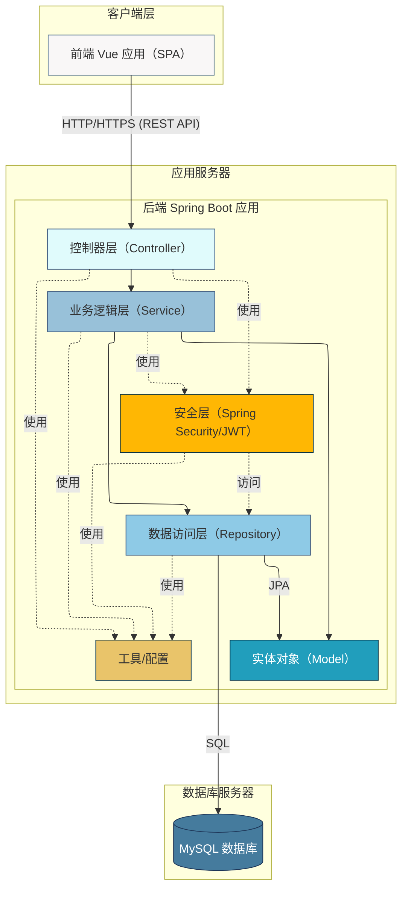
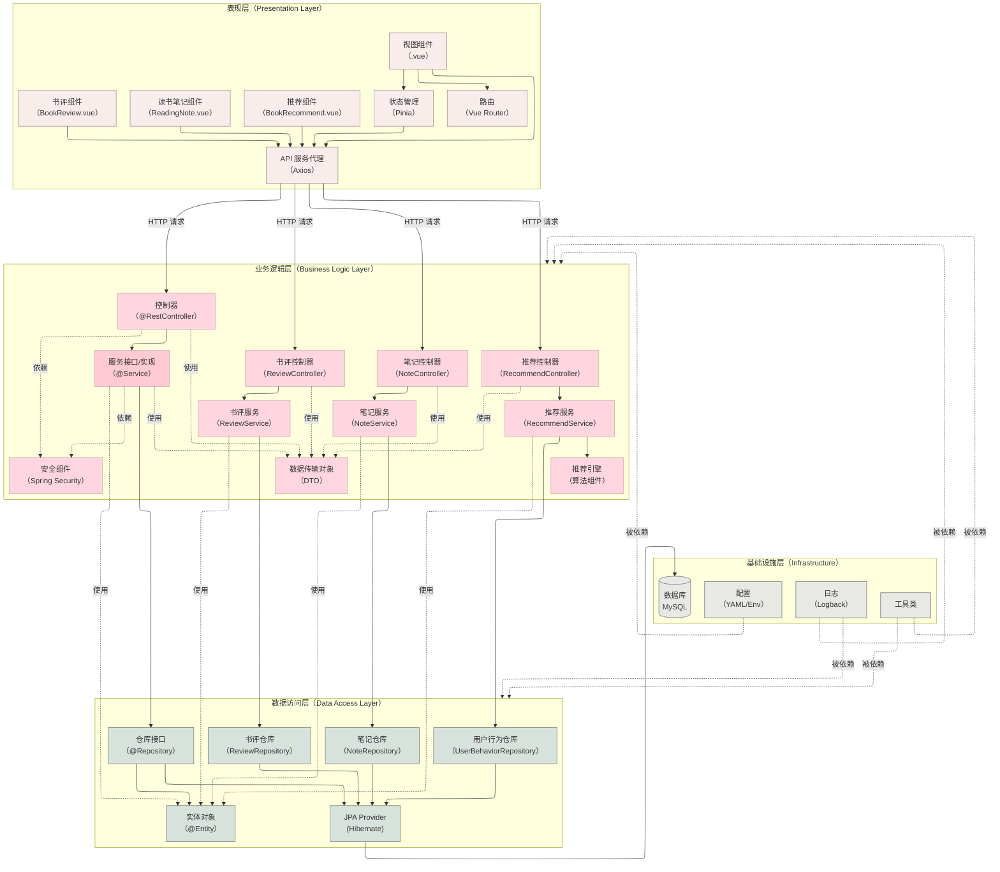
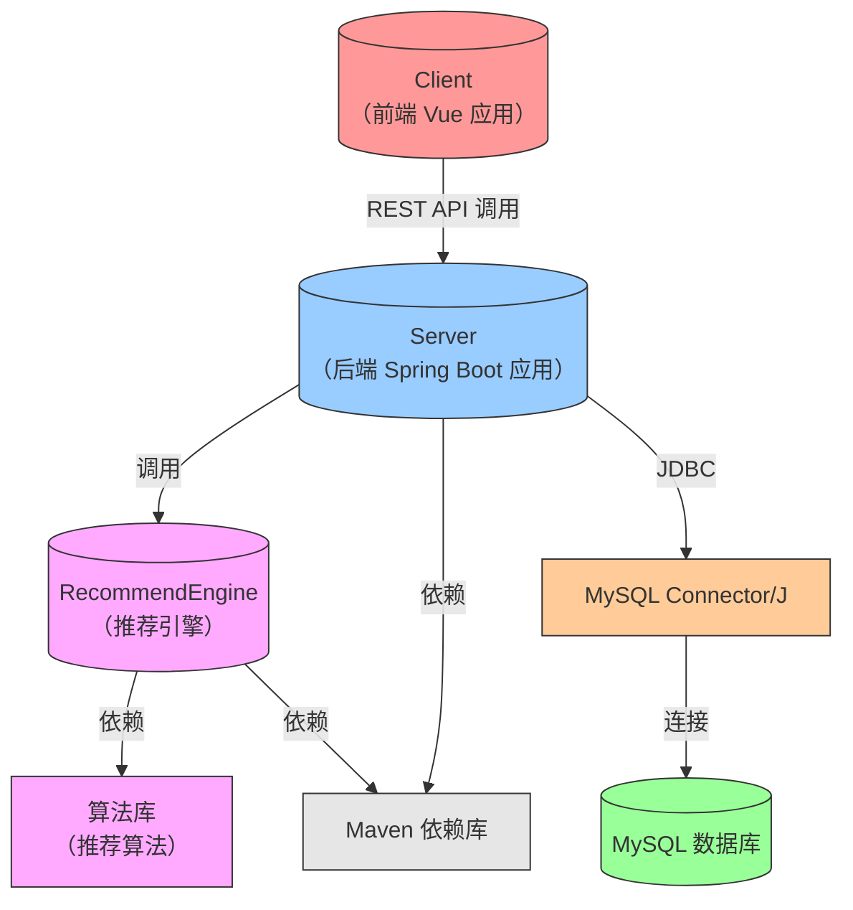
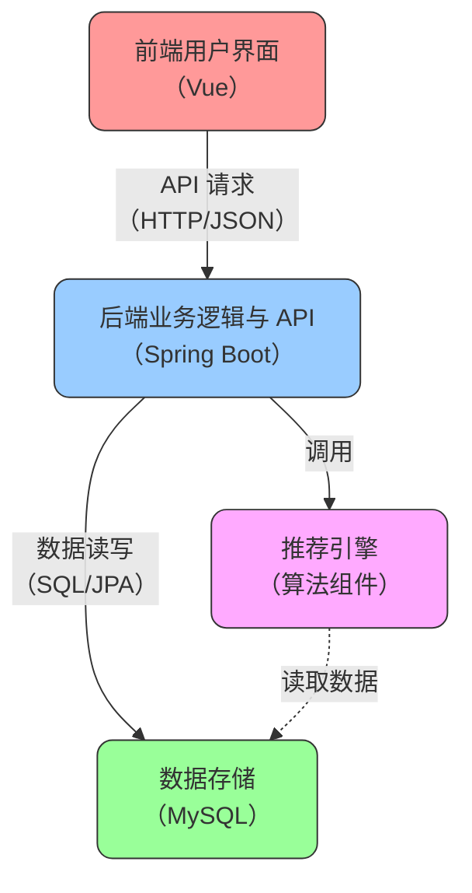

# 体系结构设计文档

## 引言

### 编制目的

本报告详细完成对番茄商城（Tomato Bookstore）系统的概要设计，达到指导详细设计和开发的目的，同时实现和测试人员及用户的沟通。

本报告面向开发人员、测试人员及最终用户而编写，是了解系统的导航。

### 词汇表

| 词汇名称        | 词汇含义                                                       | 备注                  |
| :-------------- | :------------------------------------------------------------- | :------------------ |
| Spring Boot     | 用于创建独立、生产级的基于 Spring 的应用程序的框架。           | 后端核心框架                                            |
| Spring Data JPA | Spring Data 项目的一部分，简化了基于 JPA 的数据访问层的实现。  | ORM 框架                                                       |
| MySQL           | 流行的开源关系型数据库管理系统。                               | 数据库                |
| Spring Security | 提供身份验证、授权和其他安全功能的框架。                       | 后端安全框架          |
| JWT             | JSON Web Token，一种用于安全传输信息的开放标准（RFC 7519）。   | 身份认证方案                                                              |
| Maven           | Java 项目管理和构建自动化工具。                                | 后端构建工具               |
| Lombok          | 通过注解减少 Java 样板代码的库。                               | 后端辅助工具                            |
| Vue 3           | 用于构建用户界面的渐进式 JavaScript 框架。                     | 前端核心框架                                              |
| TypeScript      | JavaScript 的超集，添加了静态类型。                            | 前端开发语言                     |
| Vite            | 新一代前端构建工具，提供极速的冷启动和热模块替换。             | 前端构建工具          |
| Element Plus    | 基于 Vue 3 的桌面端 UI 组件库。                                | UI 组件库                                    |
| Tailwind CSS    | 一个实用工具优先的 CSS 框架。                                  | CSS 框架                                     |
| Pinia           | Vue 的官方状态管理库。                                         | 前端状态管理              |
| Vue Router      | Vue.js 的官方路由管理器。                                      | 前端路由管理                 |
| Axios           | 基于 Promise 的 HTTP 客户端，用于浏览器和 Node.js。            | HTTP 请求库                                                          |
| RESTful API     | 一种基于 REST 架构风格设计的 Web API。                         | 前后端交互接口风格                                     |
| DTO             | Data Transfer Object，数据传输对象，用于在不同层之间传输数据。 | 如 `ProductDTO`                     |
| PO              | Persistent Object，持久化对象，与数据库表映射的 Java 对象。    | 如 `Product` 实体类                                                        |
| SPA             | Single Page Application，单页面应用。                          | 前端应用模式                      |
| ORM             | Object-Relational Mapping，对象关系映射。                      | 如 JPA                                  |
| RBAC            | Role-Based Access Control，基于角色的访问控制。                | 权限管理模型                            |

### 参考资料

- 《软件工程与计算（卷 2）——软件开发的技术基础》
- [项目启动文档](start.md)
- [系统用例文档](use-case.typ)
- [前端开发指南](../guide/frontend-guide.md)
- [后端开发指南](../guide/backend-guide.md)

## 产品概述

番茄商城是一个线上图书销售平台，旨在为读者提供便捷、丰富的实体书购买体验。系统采用前后端分离架构，前端使用 Vue 3 技术栈构建用户界面，后端使用 Spring Boot 技术栈提供 RESTful API 服务。

主要功能包括：

- **用户管理**：注册、登录、个人信息查看与修改。
- **商品浏览与搜索**：查看所有商品、查看商品详情、按关键词搜索商品。
- **购物车管理**：添加商品、查看购物车、修改数量、删除商品。
- **订单管理**：提交订单、查看订单、管理订单状态（支付、取消）。
- **后台管理**：管理员管理商品（增删改查、库存调整）、订单、用户等。
- **广告展示**：在前端页面展示广告信息。
- **书评模块**：用户可以针对已购买的图书发表评论和评分，分享阅读体验和见解。
- **读书笔记模块**：用户可以撰写、分享个人的读书笔记，记录阅读心得。
- **个性化推荐模块**：基于用户的浏览历史、购买记录和兴趣偏好，为用户推荐可能感兴趣的图书。

项目目标是构建一个功能完善、用户友好、具有良好可扩展性的电商平台，并在此过程中培养团队成员的软件工程实践能力。

## 逻辑视角

系统采用经典的三层架构（分层体系结构）：

1. **表现层**（Presentation Layer）：负责处理用户交互和展示信息。在本项目中，主要指前端 Vue 应用（`client` 目录）。
2. **业务逻辑层**（Business Logic Layer）：负责实现核心业务规则和流程。在本项目中，主要指后端 Spring Boot 应用中的 Service 层（`server/src/main/java/com/tomato/bookstore/service`）。
3. **数据访问层**（Data Access Layer）：负责数据的持久化和检索。在本项目中，主要指后端 Spring Boot 应用中的 Repository 层（`server/src/main/java/com/tomato/bookstore/repository`）和相关的实体类（`server/src/main/java/com/tomato/bookstore/model`）。

分层体系结构的逻辑视角图：



分层体系结构的逻辑设计方案图：



## 组合视角

### 开发包图

表 1 开发包设计：

| 开发（物理）包 | 依赖的其他开发包                                                                      |
| :------------- | :--------------------------------------------------------------------------------     |
| `client`       | `server`（通过 API）                                                                  |
| `server`       | `MySQL`（数据库驱动）, `Maven 依赖库`（Spring Boot, JPA, Security, Lombok, JWT 等） |
| `recommend`    | `server`, `Maven 依赖库`（算法库、数据处理库）                                        |

开发包图：



## 接口视角

### 模块的职责

模块视图：



各层职责：

- **表现层**（FrontendUI）：
    - 渲染用户界面，展示商品、购物车、订单等信息。
    - 处理用户输入和交互事件。
    - 调用后端 API 获取数据和执行操作。
    - 管理前端状态（如用户登录状态、购物车内容）。
    - **书评组件**：提供书评的展示、发布和交互功能。
    - **读书笔记组件**：提供读书笔记的创建、编辑和分享功能。
    - **推荐组件**：展示个性化推荐的图书列表。
- **业务逻辑层**（BackendAPI - Service）：
    - 实现系统的核心业务规则（如订单创建、库存检查、用户认证、权限控制）。
    - 编排数据访问操作。
    - 管理事务。
    - 验证输入数据的有效性。
    - 提供 RESTful API 接口供前端调用。
    - **书评服务**：处理书评的发布、查询、修改和删除逻辑。
    - **读书笔记服务**：处理读书笔记的创建、查询、更新和分享逻辑。
    - **推荐服务**：协调用户数据收集和推荐引擎，生成个性化推荐结果。
- **数据访问层**（BackendAPI - Repository & Database）：
    - 负责数据的持久化存储和检索。
    - 定义数据实体模型。
    - 提供数据访问接口（CRUD 操作）。
    - 管理数据库连接。
    - **书评仓库**：提供对书评数据的访问操作。
    - **笔记仓库**：提供对读书笔记数据的访问操作。
    - **用户行为仓库**：记录和访问用户浏览、搜索、购买等行为数据。
- **推荐引擎**：
    - 实现基于协同过滤、内容推荐等算法的图书推荐逻辑。
    - 处理用户行为数据，生成推荐结果。
    - 优化和调整推荐算法参数。

层之间调用接口示例（发布书评）：

1. **前端书评组件**（表现层）收集用户输入的书评内容和评分。
2. **API 服务代理** 发送 `POST /api/books/{bookId}/reviews` HTTP 请求到后端。
3. **ReviewController**（业务逻辑层 - 控制器）接收请求，验证用户身份和参数有效性。
4. **ReviewController** 调用 **ReviewService**（业务逻辑层 - 服务）的 `createReview(reviewDTO)` 方法。
5. **ReviewService** 检查用户是否已购买该书籍（可选），然后调用 **ReviewRepository**（数据访问层）保存书评数据。
6. **ReviewRepository** 通过 JPA 将书评信息存入数据库。
7. 操作结果逐层返回给前端，前端更新界面显示。

```java
// ReviewController.java (示例片段)
@PostMapping("/{bookId}/reviews")
public ApiResponse<ReviewDTO> createReview(
        @PathVariable Long bookId,
        @Valid @RequestBody ReviewCreateDTO reviewCreateDTO) {
    log.info("用户 {} 为图书 {} 发布书评", getCurrentUserId(), bookId);
    // 调用业务逻辑层接口
    ReviewDTO createdReview = reviewService.createReview(bookId, getCurrentUserId(), reviewCreateDTO);
    return ApiResponse.success(createdReview);
}

// ReviewServiceImpl.java (示例片段)
@Override
@Transactional
public ReviewDTO createReview(Long bookId, Long userId, ReviewCreateDTO reviewCreateDTO) {
    // 检查用户是否已购买该书籍（可选）
    if (!orderService.hasUserPurchasedBook(userId, bookId)) {
        throw new BusinessException("只有购买过此书的用户才能发表评论");
    }

    // 创建书评实体对象
    Review review = new Review();
    review.setBookId(bookId);
    review.setUserId(userId);
    review.setRating(reviewCreateDTO.getRating());
    review.setContent(reviewCreateDTO.getContent());
    review.setCreatedAt(LocalDateTime.now());

    // 保存书评
    Review savedReview = reviewRepository.save(review);

    // 返回 DTO
    return convertToDTO(savedReview);
}
```

### 用户界面层的分解

#### 职责

- **视图渲染**（Views/Components）：使用 Vue 组件展示数据和用户界面元素。
- **用户交互处理**（Components）：监听用户事件（点击、输入等）并触发相应操作。
- **路由管理**（Vue Router）：根据 URL 导航到不同的页面视图。
- **状态管理**（Pinia）：管理全局应用状态，如用户信息、购物车。
- **API 通信**（Services/Axios）：封装对后端 RESTful API 的调用。
- **书评组件**（BookReview.vue）：提供书评的列表展示、单条书评展示、发布书评表单等功能。
- **读书笔记组件**（ReadingNote.vue）：提供笔记编辑器、笔记列表、笔记详情页面。
- **推荐组件**（BookRecommend.vue）：展示个性化推荐的图书列表，可能包括"猜你喜欢"、"相关推荐"等内容。

#### 接口规范

用户界面层通过 HTTP/HTTPS 协议与后端业务逻辑层交互，遵循 RESTful API 设计规范。

- **书评相关接口**：
    - `GET /api/books/{bookId}/reviews`：获取指定图书的所有书评
    - `POST /api/books/{bookId}/reviews`：发布新书评
    - `PUT /api/reviews/{reviewId}`：更新书评内容
    - `DELETE /api/reviews/{reviewId}`：删除书评
- **读书笔记相关接口**：
    - `GET /api/notes`：获取用户的所有读书笔记
    - `GET /api/notes/{noteId}`：获取指定读书笔记详情
    - `POST /api/notes`：创建新的读书笔记
    - `PUT /api/notes/{noteId}`：更新读书笔记
    - `DELETE /api/notes/{noteId}`：删除读书笔记
    - `POST /api/notes/{noteId}/share`：分享读书笔记
- **推荐相关接口**：
    - `GET /api/recommendations`：获取个性化推荐的图书列表
    - `GET /api/books/{bookId}/related`：获取与指定图书相关的推荐

### 业务逻辑层的分解

#### 职责

- **API 接口层**（Controller）：
    - 接收前端 HTTP 请求。
    - 验证请求参数。
    - 调用 Service 层处理业务逻辑。
    - 处理异常并返回统一格式的响应。
    - 实现安全控制（如权限检查）。
- **服务层**（Service）：
    - 实现核心业务逻辑和规则。
    - 编排对数据访问层的调用。
    - 管理事务。
    - 处理 DTO 与实体对象之间的转换。
- **安全层**（Security）：
    - 处理用户认证（登录验证、JWT 生成与校验）。
    - 处理用户授权（基于角色的访问控制）。
- **书评服务**（ReviewService）：
    - 管理书评的创建、查询、更新和删除。
    - 验证用户是否有权限发布或修改书评。
    - 实现书评的评分统计和展示逻辑。
- **读书笔记服务**（NoteService）：
    - 管理读书笔记的创建、保存、查询和分享。
    - 处理笔记内容的富文本格式化和存储。
    - 实现笔记的权限控制（公开/私密）。
- **推荐服务**（RecommendService）：
    - 收集和分析用户行为数据。
    - 调用推荐引擎生成推荐结果。
    - 缓存和管理推荐结果，提高响应速度。
- **推荐引擎**（RecommendEngine）：
    - 实现基于不同算法的图书推荐策略。
    - 处理用户历史行为和兴趣模型。
    - 执行推荐算法计算并输出结果。

#### 接口规范

书评控制器接口：

```java
@RestController
@RequestMapping("/api/books/{bookId}/reviews")
@RequiredArgsConstructor
@Slf4j
public class ReviewController {
    private final ReviewService reviewService;

    @GetMapping
    public ApiResponse<Page<ReviewDTO>> getBookReviews(
            @PathVariable Long bookId,
            @RequestParam(defaultValue = "0") int page,
            @RequestParam(defaultValue = "10") int size) {
        // 实现获取书评列表
    }

    @PostMapping
    @PreAuthorize("isAuthenticated()")
    public ApiResponse<ReviewDTO> createReview(
            @PathVariable Long bookId,
            @Valid @RequestBody ReviewCreateDTO reviewCreateDTO) {
        // 实现创建书评
    }

    // 其他方法...
}
```

读书笔记控制器接口：

```java
@RestController
@RequestMapping("/api/notes")
@RequiredArgsConstructor
@Slf4j
public class NoteController {
    private final NoteService noteService;

    @GetMapping
    @PreAuthorize("isAuthenticated()")
    public ApiResponse<Page<NoteDTO>> getUserNotes(
            @RequestParam(defaultValue = "0") int page,
            @RequestParam(defaultValue = "10") int size) {
        // 实现获取用户笔记列表
    }

    @PostMapping
    @PreAuthorize("isAuthenticated()")
    public ApiResponse<NoteDTO> createNote(
            @Valid @RequestBody NoteCreateDTO noteCreateDTO) {
        // 实现创建笔记
    }

    // 其他方法...
}
```

推荐控制器接口：

```java
@RestController
@RequestMapping("/api/recommendations")
@RequiredArgsConstructor
@Slf4j
public class RecommendController {
    private final RecommendService recommendService;

    @GetMapping
    public ApiResponse<List<BookDTO>> getPersonalizedRecommendations(
            @RequestParam(defaultValue = "12") int limit) {
        // 实现获取个性化推荐
    }

    @GetMapping("/books/{bookId}/related")
    public ApiResponse<List<BookDTO>> getRelatedBooks(
            @PathVariable Long bookId,
            @RequestParam(defaultValue = "6") int limit) {
        // 实现获取相关图书推荐
    }

    // 其他方法...
}
```

### 数据层的分解

#### 职责

- **实体层**（Model/Entity）：
    - 定义与数据库表映射的持久化对象（PO）。
    - 使用 JPA 注解（`@Entity`, `@Table`, `@Id` 等）。
- **仓库层**（Repository）：
    - 定义数据访问接口，继承 JpaRepository。
    - 提供 CRUD 操作和自定义查询方法。
- **新增实体类**：
    - **Review**：书评实体，包含评分、内容、用户ID、图书ID等字段。
    - **Note**：读书笔记实体，包含标题、内容、是否公开、用户ID、关联图书ID等字段。
    - **UserBehavior**：用户行为实体，记录用户的浏览历史、搜索记录、购买记录等。
- **新增仓库接口**：
    - **ReviewRepository**：提供书评的 CRUD 和查询操作。
    - **NoteRepository**：提供读书笔记的 CRUD 和查询操作。
    - **UserBehaviorRepository**：提供用户行为数据的存储和检索操作。

#### 接口规范

书评仓库接口：

```java
@Repository
public interface ReviewRepository extends JpaRepository<Review, Long> {
    // 查询指定图书的所有书评，按创建时间倒序排列
    Page<Review> findByBookIdOrderByCreatedAtDesc(Long bookId, Pageable pageable);

    // 查询用户发布的所有书评
    List<Review> findByUserId(Long userId);

    // 检查用户是否已经评论过指定图书
    boolean existsByBookIdAndUserId(Long bookId, Long userId);

    // 计算图书的平均评分
    @Query("SELECT AVG(r.rating) FROM Review r WHERE r.bookId = :bookId")
    Double calculateAverageRating(@Param("bookId") Long bookId);
}
```

读书笔记仓库接口：

```java
@Repository
public interface NoteRepository extends JpaRepository<Note, Long> {
    // 查询用户的所有笔记
    Page<Note> findByUserIdOrderByUpdatedAtDesc(Long userId, Pageable pageable);

    // 查询公开的笔记
    Page<Note> findByIsPublicTrueOrderByCreatedAtDesc(Pageable pageable);

    // 查询与特定图书相关的公开笔记
    List<Note> findByBookIdAndIsPublicTrue(Long bookId);

    // 根据标题或内容进行模糊搜索
    @Query("SELECT n FROM Note n WHERE n.userId = :userId AND " +
           "(LOWER(n.title) LIKE LOWER(CONCAT('%', :keyword, '%')) OR " +
           "LOWER(n.content) LIKE LOWER(CONCAT('%', :keyword, '%')))")
    List<Note> searchUserNotes(@Param("userId") Long userId, @Param("keyword") String keyword);
}
```

用户行为仓库接口：

```java
@Repository
public interface UserBehaviorRepository extends JpaRepository<UserBehavior, Long> {
    // 获取用户最近的浏览历史
    List<UserBehavior> findByUserIdAndBehaviorTypeOrderByCreatedAtDesc(
            Long userId, BehaviorType behaviorType, Pageable pageable);

    // 获取图书的浏览/购买频率
    @Query("SELECT COUNT(ub) FROM UserBehavior ub WHERE ub.bookId = :bookId AND ub.behaviorType = :type")
    Long countByBookIdAndBehaviorType(@Param("bookId") Long bookId, @Param("type") BehaviorType type);

    // 获取用户对某类别图书的兴趣程度（通过行为次数）
    @Query("SELECT COUNT(ub) FROM UserBehavior ub " +
           "JOIN Book b ON ub.bookId = b.id " +
           "JOIN b.categories c " +
           "WHERE ub.userId = :userId AND c.id = :categoryId AND ub.behaviorType IN :types")
    Long countUserInterestInCategory(
            @Param("userId") Long userId,
            @Param("categoryId") Long categoryId,
            @Param("types") List<BehaviorType> types);
}
```

## 信息视角

### 描述数据持久化对象（PO）

主要的持久化对象（实体类）及其职责：

- **User**(`users` 表)：存储用户信息，包括用户名、密码（加密）、邮箱、电话、角色、地址、头像等。
- **Product**(`products` 表)：存储商品基本信息，如图书名称、价格、评分、描述、封面图片、详情介绍等。
- **Specification**(`specifications` 表)：存储商品的规格信息（如作者、出版社、ISBN、页数），与 `Product` 是一对多关系。
- **Stockpile**(`stockpiles` 表)：存储商品的库存信息（可用数量、冻结数量），与 `Product` 是一对一关系。
- **Cart**(`carts` 表)：存储用户的购物车项，包含用户 ID、商品 ID、数量。
- **Order**(`orders` 表)：存储订单头信息，包含订单号、用户 ID、总金额、支付方式、状态、收货地址、支付时间等。
- **CartsOrdersRelation**(`carts_orders_relation` 表)：订单项，存储订单与购物车项（商品）的关联及购买数量，作为 `Order` 和 `Cart` 之间的连接表（虽然命名可能需要优化，但反映了当前结构）。
- **Advertisement**(`advertisements` 表)：存储广告信息，包含标题、内容、图片 URL、关联的商品 ID。
- **Review**(`reviews` 表)：存储书评信息，包含用户 ID、图书 ID、评分、内容、创建时间等。与 `User` 和 `Product` 分别是多对一关系。
- **Note**(`notes` 表)：存储读书笔记信息，包含标题、内容、是否公开、用户 ID、关联图书 ID（可选）、创建时间、更新时间等。与 `User` 是多对一关系，与 `Product` 是多对一关系（可选）。
- **UserBehavior**(`user_behaviors` 表)：记录用户行为数据，包含用户 ID、行为类型（浏览、搜索、购买等）、图书 ID、发生时间等。用于个性化推荐算法的输入数据。

这些 PO 使用 JPA 注解进行数据库映射，并通过 Lombok 注解简化代码。

### 数据库表

根据 `init.sql` 和实体类定义，主要数据库表如下：

| 表名                    | 主要职责                           | 关联表                                                                        |
| :---------------------- | :--------------------------------- | :---------------------------------------------------------------------------- |
| `users`                 | 存储用户信息                       | `carts`, `orders`, `reviews`, `notes`, `user_behaviors`                       |
| `products`              | 存储商品基本信息                   | `specifications`, `stockpiles`, `carts`, `advertisements`, `reviews`, `notes` |
| `specifications`        | 存储商品规格                       | `products` (ManyToOne)                                                        |
| `stockpiles`            | 存储商品库存                       | `products` (OneToOne)                                                         |
| `carts`                 | 存储用户购物车项                   | `users`, `products`, `carts_orders_relation`                                  |
| `orders`                | 存储订单头信息                     | `users`, `carts_orders_relation`                                              |
| `carts_orders_relation` | 存储订单项（订单与购物车商品关联） | `carts`, `orders`                                                             |
| `advertisements`        | 存储广告信息                       | `products`                                                                    |
| `reviews`               | 存储用户对图书的评论和评分         | `users`, `products`                                                           |
| `notes`                 | 存储用户的读书笔记                 | `users`, `products`（可选）                                                   |
| `user_behaviors`        | 记录用户行为数据                   | `users`, `products`                                                           |
