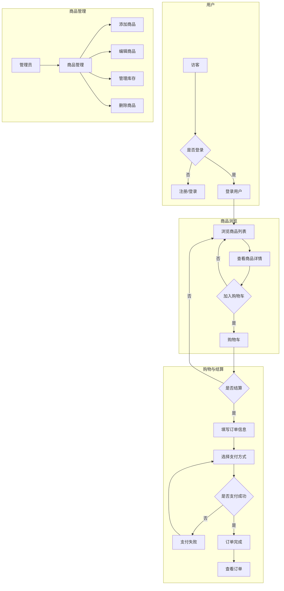
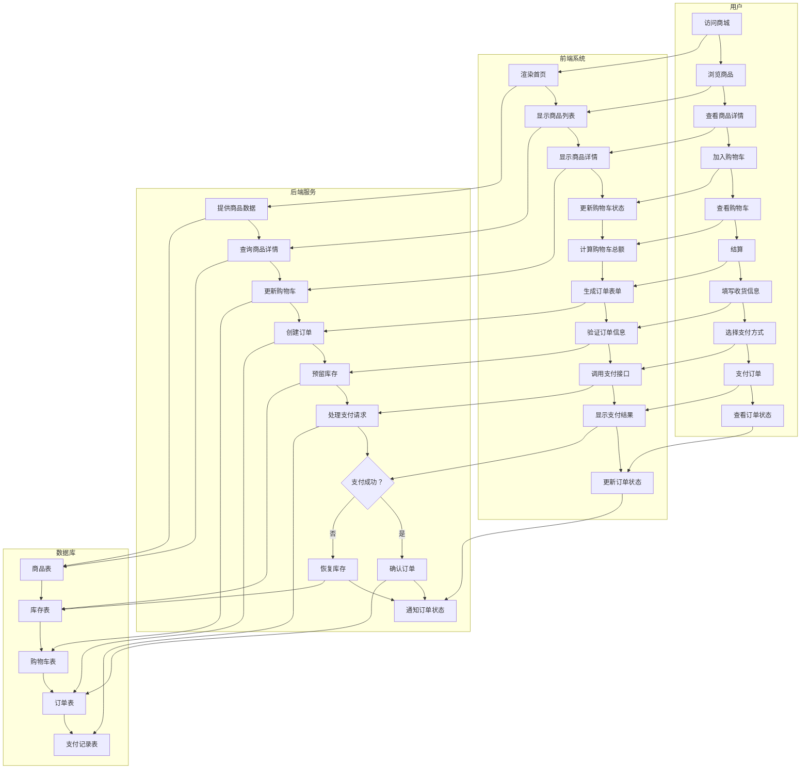
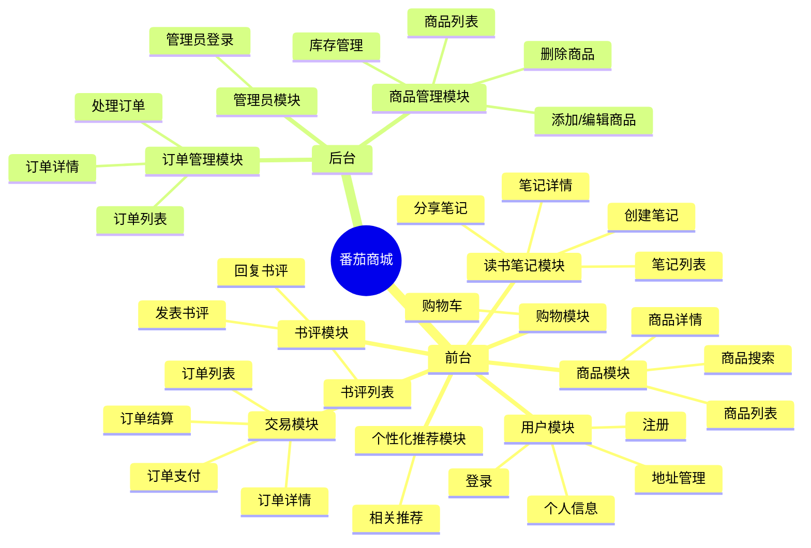
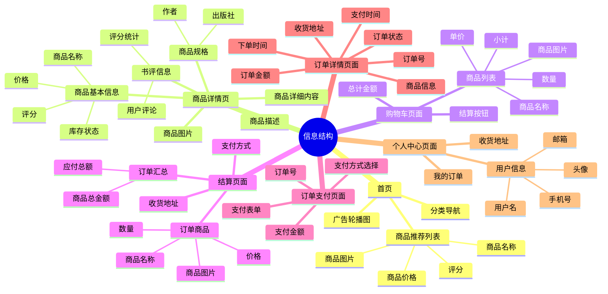
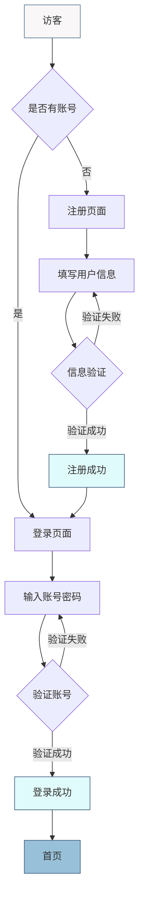
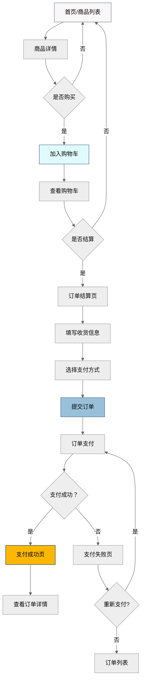
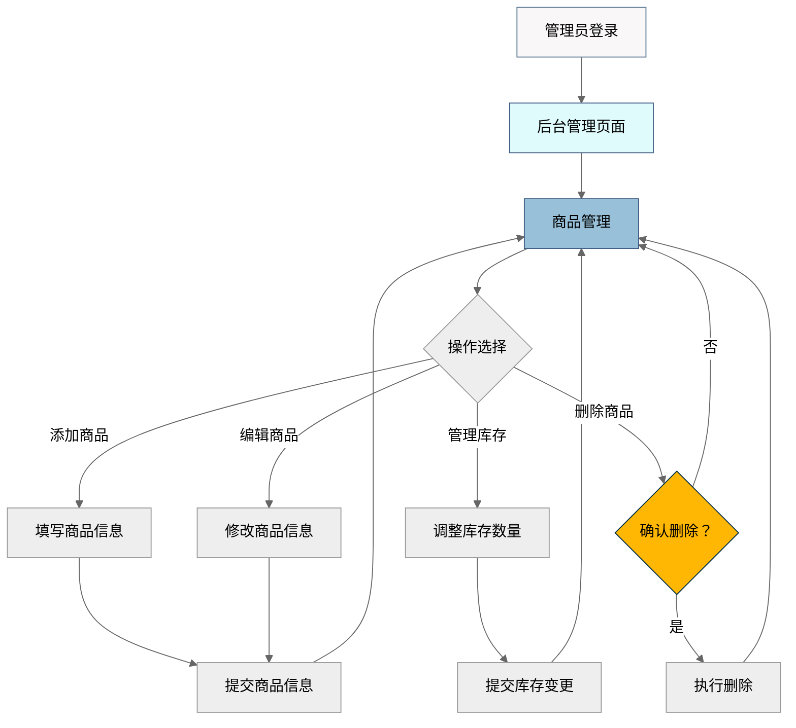
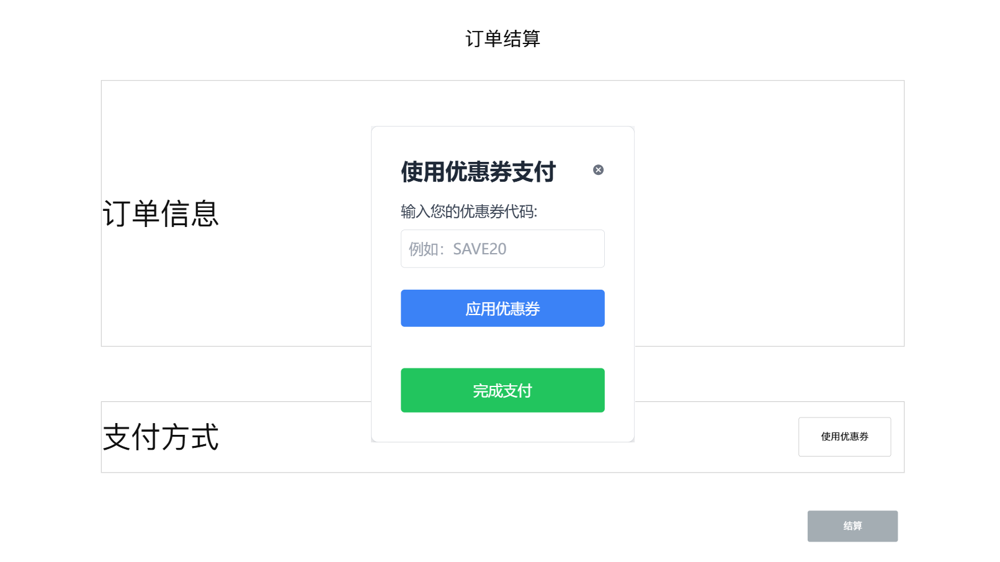

# 人机交互设计文档

## 设计背景与思路

### 用户画像

番茄商城主要面向以下几类用户：
1. **图书爱好者**
   - 年龄：18-45 岁
   - 特点：热爱阅读，经常购买图书，对图书内容有较高要求
   - 需求：希望能方便地找到各类优质图书，获取详细的图书信息，分享读书心得
2. **学生群体**
   - 年龄：16-25 岁
   - 特点：为学习或考试购买书籍，预算有限，对价格敏感
   - 需求：价格合理，能够查看评价和推荐，方便比较不同版本
3. **知识工作者**
   - 年龄：25-45 岁
   - 特点：为工作需要购买专业书籍，注重实用性
   - 需求：详细准确的书籍信息，专业分类，便捷的支付和配送服务
4. **管理员**
   - 特点：负责商城的日常运营和管理
   - 需求：便捷的商品管理、订单处理和用户管理功能

### 设计理念

番茄商城的设计围绕以下几个核心理念：
1. **简洁直观**：界面设计简洁明了，用户能够快速找到所需功能和信息。
2. **响应式体验**：适配多种设备和屏幕尺寸，确保良好的用户体验。
3. **渐进式功能**：基本功能（浏览、购买）简单易用，高级功能（评论、笔记、推荐）在需要时提供。
4. **视觉一致性**：采用一致的色彩（以番茄红为主色调）、字体和交互方式，提供统一的品牌体验。
5. **高效交互**：减少用户操作步骤，优化关键流程（如购买、支付），提高用户效率。

## 业务流程

番茄商城的核心业务流程如下，包括用户注册登录、商品浏览、购物车管理、下单支付等环节：



### 详细业务流程（泳道图）

以下泳道图展示了买家购物的完整业务流程，以及各角色之间的交互：



## 页面交互

### 产品结构、信息结构

#### 产品结构图

产品结构图展示了番茄商城的整体功能模块：



#### 信息结构图

信息结构图展示了各页面包含的主要信息元素：



### 操作流程图

#### 用户注册登录



#### 商品浏览与购买



#### 后台商品管理



### 原型图

比较简陋的原型图（也没实现「优惠券」啊，也不在自选计划中啊）：



## 全局通用说明

### 常用控件

番茄商城采用 Element Plus 组件库，并结合自定义样式，主要使用以下控件：

1. **按钮 `el-button`**
   - 主按钮：番茄红色调，圆角边框，用于主要操作
   - 次要按钮：白色背景，边框样式，用于次要操作
   - 危险按钮：红色调，用于删除等危险操作

   示例样式：
   ```css
   .el-button--primary {
     @apply bg-tomato-500 border-tomato-500 hover:bg-tomato-600 hover:border-tomato-600 transition-all duration-300;
     box-shadow: 0 4px 15px 0 rgba(255, 107, 107, 0.4);
     border-radius: 0.75rem;
   }
   ```

2. **输入框 `el-input`**
   - 标准输入框：带有轻微阴影和聚焦效果
   - 搜索框：带有搜索图标
   - 文本域：多行文本输入

   示例样式：
   ```css
   .el-input__wrapper {
     transition: all 0.3s ease;
     border-radius: 0.75rem;
     box-shadow: 0 1px 2px 0 rgba(0, 0, 0, 0.05);
     background-color: rgba(255, 255, 255, 0.8);
     backdrop-filter: blur(8px);
   }
   ```

3. **表单项 `el-form-item`**
   - 标签位置：顶部对齐
   - 错误提示：文本下方红色提示

4. **选择器 `el-select`**
   - 下拉菜单式选择器
   - 带搜索功能的选择器

5. **表格 `el-table`**
   - 带边框的标准表格
   - 可选择、可排序
   - 支持自定义列模板

6. **分页器 `el-pagination`**
   - 带页码和页面大小选择

7. **对话框 `el-dialog`**
   - 模态对话框，用于确认操作或表单提交
   - 带有半透明背景遮罩

   示例样式：
   ```css
   .el-dialog {
     @apply rounded-2xl overflow-hidden;
     backdrop-filter: blur(15px);
     background-color: rgba(255, 255, 255, 0.95);
   }
   ```

8. **消息提示 `el-message`**
   - 成功、警告、错误、信息四种类型
   - 顶部居中显示，自动消失

9. **加载状态 `el-loading`**
   - 全屏加载
   - 局部组件加载

10. **标签 `el-tag`**
    - 不同颜色标签用于状态区分
    - 可关闭标签

### 复用界面/组件

以下是番茄商城中全局可复用的组件：

1. **页面布局组件**
   - `Header.vue`: 页面顶部导航栏，包含 Logo、搜索框、导航菜单和用户区域
   - `Footer.vue`: 页面底部，包含网站信息、联系方式和友情链接
   - `PageTransition.vue`: 页面切换过渡效果组件

2. **商品相关组件**
   - `ProductCard.vue`: 商品卡片，用于商品列表展示
   - `ProductForm.vue`: 商品表单，用于添加/编辑商品
   - `ProductRating.vue`: 商品评分展示组件

3. **用户相关组件**
   - `LoginForm.vue`: 登录表单
   - `RegisterForm.vue`: 注册表单
   - `ProfileForm.vue`: 个人信息表单

4. **交互反馈组件**
   - `ConfettiButton.vue`: 点击后显示庆祝效果的按钮
   - `EmptyState.vue`: 数据为空状态展示
   - `ErrorState.vue`: 错误状态展示

5. **广告组件**
   - `AdvertisementCard.vue`: 广告卡片
   - `AdvertisementList.vue`: 广告列表

### 单位规范

为确保界面一致性，番茄商城遵循以下单位规范：

1. **时间格式**
   - 刚刚：当前时间 - 创建时间 < 1 分钟
   - x 分钟前：当前时间 - 创建时间 < 1 小时
   - x 小时前：当前时间 - 创建时间 < 24 小时
   - 昨天 HH:MM：当前时间 - 创建时间 < 48 小时
   - MM 月 DD 日：当前年份的其他日期
   - YYYY 年 MM 月 DD 日：非当前年份的日期
   - 详细时间格式：YYYY-MM-DD HH:MM:SS

2. **金额格式**
   - 使用 ¥ 符号前缀
   - 数字格式：¥1,234.56
   - 整数金额：¥1,234
   - 免费商品：¥0 或「免费」

   实现代码（`formatPrice` 函数）：
   ```typescript
   export function formatPrice(price?: number): string {
     if (price === undefined || price === null) return "¥0.00";
     return new Intl.NumberFormat("zh-CN", {
       style: "currency",
       currency: "CNY",
       minimumFractionDigits: price % 1 === 0 ? 0 : 2,
     }).format(price);
   }
   ```

3. **尺寸单位**
   - 字体大小：使用 rem/em 单位，如 1rem, 1.25rem
   - 间距与外边距：使用 rem 或 Tailwind CSS 的间距类，如 p-4, my-6
   - 边框圆角：使用 rem 或 Tailwind CSS 的圆角类，如 rounded-lg
   - 图片尺寸：根据场景使用百分比、rem 或固定像素值

4. **数量格式**
   - 数量显示：直接展示数字，如 5, 10
   - 大数量显示：使用千分位分隔符，如 1,234
   - 库存状态：
     - 充足：> 10
     - 紧张：≤ 10
     - 无货：0

### 缺省页汇总

番茄商城针对不同状态提供了以下缺省页面：

1. **加载中**
   - 使用 `el-skeleton` 组件显示骨架屏
   - 带有淡入淡出动画效果
   ```vue
   <div v-if="loading" class="max-w-6xl mx-auto">
     <el-skeleton :rows="10" animated />
   </div>
   ```

2. **空数据状态**
   - 使用 `el-empty` 组件
   - 根据上下文提供个性化描述文本
   - 提供后续操作按钮
   ```vue
   <el-empty
     description="您的购物车是空的"
     class="py-16"
   >
     <template #extra>
       <el-button type="primary" @click="router.push(Routes.PRODUCT_LIST)" class="rounded-lg">
         去购物
       </el-button>
     </template>
   </el-empty>
   ```

3. **错误状态**
   - 使用 `el-result` 组件
   - 显示错误图标、标题和描述
   - 提供重试或返回按钮
   ```vue
   <el-result
     icon="error"
     title="商品不存在"
     sub-title="找不到该商品或已被删除"
   >
     <template #extra>
       <el-button type="primary" @click="router.push(Routes.PRODUCT_LIST)" class="rounded-lg">
         查看所有商品
       </el-button>
     </template>
   </el-result>
   ```

4. **订单状态变更**
   - 支付成功：显示成功图标、庆祝动画和订单信息
   - 支付失败：显示错误图标和重试选项
   - 订单取消：显示信息图标和取消原因

各模块具体缺省页如下：

- **商品模块**
  - 商品不存在：显示错误提示和「查看所有商品」按钮
- **购物车模块**
  - 购物车为空：显示「购物车是空的」提示和「去购物」按钮
- **订单模块**
  - 订单不存在：显示「订单不存在或已被删除」提示
- **用户模块**
  - 未登录状态：显示登录提示和登录按钮
