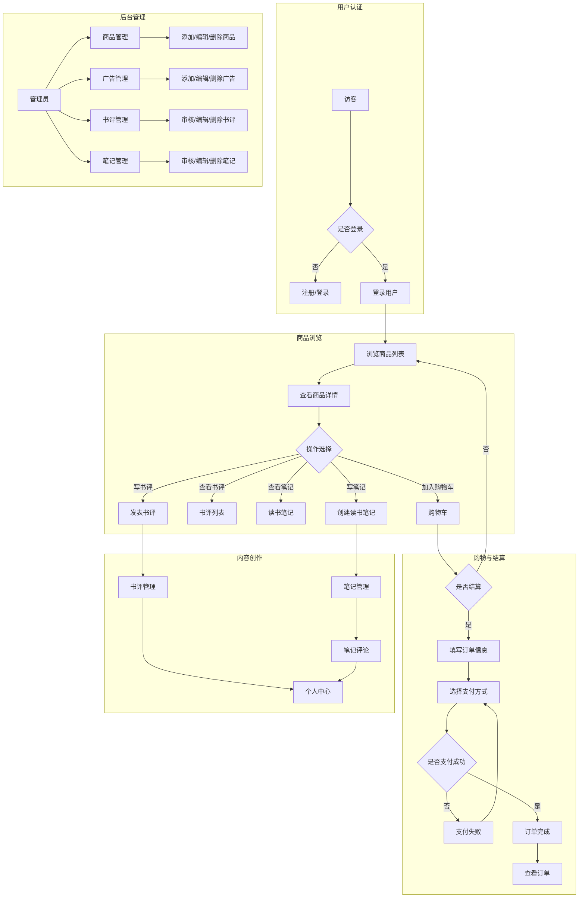
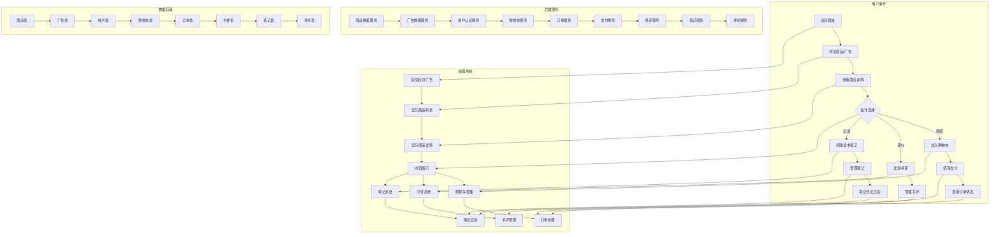
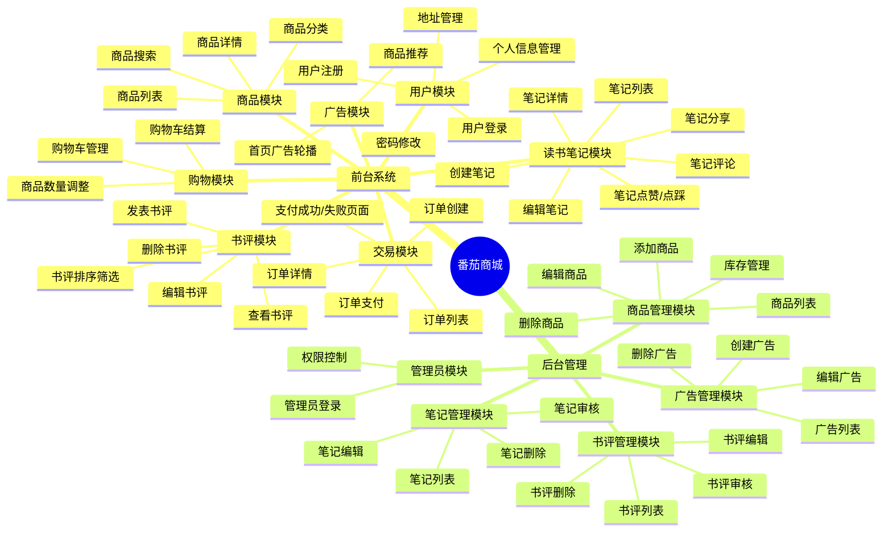
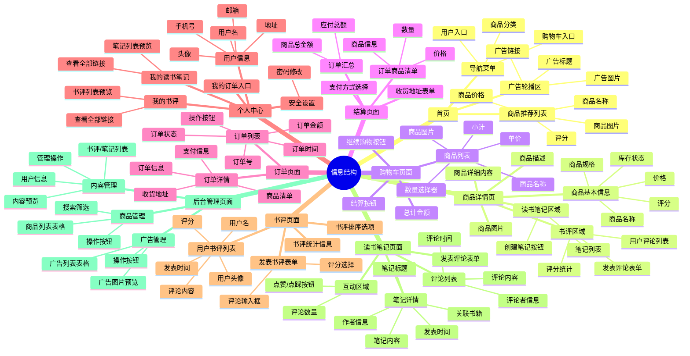
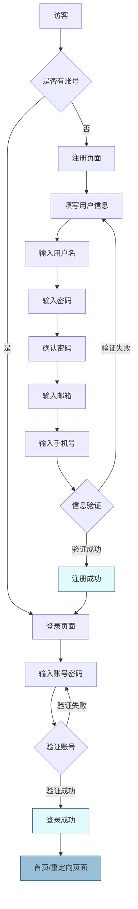
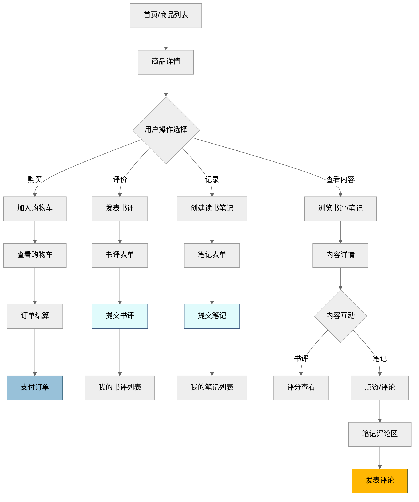
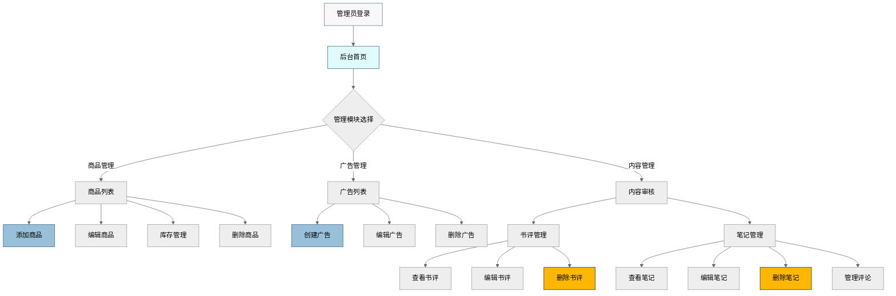

# 人机交互设计文档

## 设计背景与思路

### 用户画像

番茄商城主要面向以下几类用户：
1. **图书爱好者**
    - 年龄：18-45 岁
    - 特点：热爱阅读，经常购买图书，对图书内容有较高要求
    - 需求：希望能方便地找到各类优质图书，获取详细的图书信息，分享读书心得和笔记
2. **学生群体**
    - 年龄：16-25 岁
    - 特点：为学习或考试购买书籍，预算有限，对价格敏感
    - 需求：价格合理，能够查看评价和推荐，方便比较不同版本
3. **知识工作者**
    - 年龄：25-45 岁
    - 特点：为工作需要购买专业书籍，注重实用性
    - 需求：详细准确的书籍信息，专业分类，便捷的支付和配送服务
4. **管理员**
    - 特点：负责商城的日常运营和管理
    - 需求：便捷的商品管理、订单处理、用户内容管理功能

### 设计理念

番茄商城的设计围绕以下几个核心理念：
1. **简洁直观**：界面设计简洁明了，用户能够快速找到所需功能和信息。
2. **响应式体验**：适配多种设备和屏幕尺寸，确保良好的用户体验。
3. **渐进式功能**：基本功能（浏览、购买）简单易用，高级功能（评论、笔记、推荐）在需要时提供。
4. **视觉一致性**：采用一致的色彩（以番茄红为主色调）、字体和交互方式，提供统一的品牌体验。
5. **高效交互**：减少用户操作步骤，优化关键流程（如购买、支付），提高用户效率。
6. **社交化阅读**：鼓励用户分享书评和读书笔记，形成阅读社区氛围。

## 业务流程

番茄商城的核心业务流程如下，包括用户注册登录、商品浏览、购物车管理、下单支付、内容创作等环节：



### 详细业务流程（泳道图）

以下泳道图展示了用户完整使用流程，以及各模块之间的交互：



## 页面交互

### 产品结构、信息结构

#### 产品结构图

产品结构图展示了番茄商城的整体功能模块：



#### 信息结构图

信息结构图展示了各页面包含的主要信息元素：



### 操作流程图

#### 用户注册登录



#### 商品浏览与内容创作



#### 后台内容管理



### 页面原型图

比较简陋的原型图，展示主要页面布局：


## 全局通用说明

### 常用控件

番茄商城采用 Element Plus 组件库，并结合自定义样式，主要使用以下控件：

1. **按钮 `el-button`**
    - 主按钮：番茄红色调，圆角边框，用于主要操作
    - 次要按钮：白色背景，边框样式，用于次要操作
    - 危险按钮：红色调，用于删除等危险操作
    - 文本按钮：用于链接式操作

    示例样式：
    ```css
    .el-button--primary {
      @apply bg-tomato-500 border-tomato-500 hover:bg-tomato-600 hover:border-tomato-600 transition-all duration-300;
      box-shadow: 0 4px 15px 0 rgba(255, 107, 107, 0.4);
      border-radius: 0.75rem;
    }
    ```

2. **输入框 `el-input`**
    - 标准输入框：带有轻微阴影和聚焦效果
    - 搜索框：带有搜索图标
    - 文本域：多行文本输入，用于评论和笔记内容
    - 数字输入框：用于数量选择和价格输入

3. **表单相关**
    - 表单项 `el-form-item`：标签位置顶部对齐
    - 选择器 `el-select`：下拉菜单式选择器
    - 评分组件 `el-rate`：用于商品评分和书评评分
    - 单选/复选框：用于支付方式选择等

4. **数据展示**
    - 表格 `el-table`：带边框的标准表格，支持排序和分页
    - 卡片 `el-card`：用于商品展示和内容展示
    - 标签 `el-tag`：用于状态标识和分类
    - 头像 `el-avatar`：用户头像展示

5. **反馈组件**
    - 对话框 `el-dialog`：模态对话框，用于表单提交和确认操作
    - 消息提示 `el-message`：成功、警告、错误、信息四种类型
    - 通知 `el-notification`：用于重要信息通知
    - 加载状态 `el-loading`：全屏和局部加载

6. **导航组件**
    - 分页器 `el-pagination`：带页码和页面大小选择
    - 面包屑 `el-breadcrumb`：页面导航路径
    - 标签页 `el-tabs`：用于个人中心等多标签页面

### 复用界面/组件

以下是番茄商城中全局可复用的组件：
1. **页面布局组件**
    - `Header.vue`: 页面顶部导航栏，包含 Logo、搜索框、导航菜单和用户区域
    - `Footer.vue`: 页面底部，包含网站信息、联系方式和友情链接
    - `PageTransition.vue`: 页面切换过渡效果组件
2. **商品相关组件**
    - `ProductCard.vue`: 商品卡片，用于商品列表展示
    - `ProductForm.vue`: 商品表单，用于添加/编辑商品
3. **用户相关组件**
    - `LoginForm.vue`: 登录表单
    - `RegisterForm.vue`: 注册表单
    - `ProfileForm.vue`: 个人信息表单
4. **内容相关组件**
    - `ReviewList.vue`: 书评列表展示
    - `ReviewItem.vue`: 单个书评项
    - `ReviewForm.vue`: 书评发表/编辑表单
    - `NoteList.vue`: 读书笔记列表
    - `NoteCard.vue`: 笔记卡片展示
    - `NoteDetail.vue`: 笔记详情页面
    - `NoteForm.vue`: 笔记创建/编辑表单
    - `NoteCommentList.vue`: 笔记评论列表
    - `NoteCommentForm.vue`: 评论发表表单
5. **交互反馈组件**
    - `ConfettiButton.vue`: 点击后显示庆祝效果的按钮
    - `EmptyState.vue`: 数据为空状态展示
    - `ErrorState.vue`: 错误状态展示
6. **广告组件**
    - `AdvertisementCard.vue`: 广告卡片
    - `AdvertisementList.vue`: 广告列表
    - `AdvertisementForm.vue`: 广告创建/编辑表单

### 单位规范

为确保界面一致性，番茄商城遵循以下单位规范：

1. **时间格式**
    - 刚刚：当前时间 - 创建时间 < 1 分钟
    - x 分钟前：当前时间 - 创建时间 < 1 小时
    - x 小时前：当前时间 - 创建时间 < 24 小时
    - 昨天 HH:MM：当前时间 - 创建时间 < 48 小时
    - MM 月 DD 日：当前年份的其他日期
    - YYYY 年 MM 月 DD 日：非当前年份的日期
    - 详细时间格式：YYYY-MM-DD HH:MM:SS

2. **金额格式**
    - 使用 ¥ 符号前缀
    - 数字格式：¥1,234.56
    - 整数金额：¥1,234
    - 免费商品：¥0 或「免费」

    实现代码（`formatPrice` 函数）：
    ```typescript
    export function formatPrice(price?: number): string {
      if (price === undefined || price === null) return "¥0.00";
      return new Intl.NumberFormat("zh-CN", {
        style: "currency",
        currency: "CNY",
        minimumFractionDigits: price % 1 === 0 ? 0 : 2,
      }).format(price);
    }
    ```

3. **尺寸单位**
    - 字体大小：使用 rem/em 单位，如 1rem, 1.25rem
    - 间距与外边距：使用 rem 或 Tailwind CSS 的间距类，如 p-4, my-6
    - 边框圆角：使用 rem 或 Tailwind CSS 的圆角类，如 rounded-lg
    - 图片尺寸：根据场景使用百分比、rem 或固定像素值

4. **数量格式**
    - 数量显示：直接展示数字，如 5, 10
    - 大数量显示：使用千分位分隔符，如 1,234
    - 库存状态：
        - 充足：> 10
        - 紧张：≤ 10
        - 无货：0

5. **评分格式**
    - 商品评分：0-10 分制，显示一位小数
    - 书评评分：0-10 分制，整数显示
    - 星级显示：0-5 星，支持半星

### 缺省页汇总

番茄商城针对不同状态提供了以下缺省页面：

1. **加载中状态**
    - 使用 `el-skeleton` 组件显示骨架屏
    - 带有淡入淡出动画效果
    ```vue
    <div v-if="loading" class="max-w-6xl mx-auto">
      <el-skeleton :rows="10" animated />
    </div>
    ```

2. **空数据状态**
    - 使用 `el-empty` 组件
    - 根据上下文提供个性化描述文本
    - 提供后续操作按钮
    ```vue
    <el-empty
      description="您的购物车是空的"
      class="py-16"
    >
      <template #extra>
        <el-button type="primary" @click="router.push(Routes.PRODUCT_LIST)" class="rounded-lg">
          去购物
        </el-button>
      </template>
    </el-empty>
    ```

3. **错误状态**
    - 使用 `el-result` 组件
    - 显示错误图标、标题和描述
    - 提供重试或返回按钮
    ```vue
    <el-result
      icon="error"
      title="商品不存在"
      sub-title="找不到该商品或已被删除"
    >
      <template #extra>
        <el-button type="primary" @click="router.push(Routes.PRODUCT_LIST)" class="rounded-lg">
          查看所有商品
        </el-button>
      </template>
    </el-result>
    ```

4. **订单状态变更**
    - 支付成功：显示成功图标、庆祝动画和订单信息
    - 支付失败：显示错误图标和重试选项
    - 订单取消：显示信息图标和取消原因

各模块具体缺省页如下：
- **商品模块**
  - 商品不存在：显示错误提示和「查看所有商品」按钮
  - 商品列表为空：显示「暂无商品」提示
- **购物车模块**
  - 购物车为空：显示「购物车是空的」提示和「去购物」按钮
- **订单模块**
  - 订单不存在：显示「订单不存在或已被删除」提示
  - 订单列表为空：显示「您还没有订单」提示和「去购物」按钮
- **书评模块**
  - 无书评：显示「暂无评价」提示和登录/评价引导
  - 用户无书评：显示「您还没有发表过任何书评」提示
- **读书笔记模块**
  - 无笔记：显示「暂无读书笔记」提示和创建引导
  - 用户无笔记：显示「您还没有创建过任何读书笔记」提示
  - 笔记无评论：显示「暂无评论，来抢沙发吧」提示
- **用户模块**
  - 未登录状态：显示登录提示和登录按钮
- **广告模块**
  - 无广告：正常显示其他内容，不显示广告区域

## 交互特性

### 动画与过渡效果

1. **页面过渡动画**
    - 使用 `PageTransition` 组件实现平滑的页面切换
    - 透明度渐变配合轻微位移效果
2. **内容加载动画**
    - 骨架屏动画：使用渐变效果模拟内容加载
    - 列表项进入动画：支持交错动画效果
3. **交互反馈动画**
    - 按钮点击：轻微的缩放和颜色变化
    - 悬停效果：阴影变化和轻微位移
    - 成功操作：庆祝动画效果（ConfettiButton）

### 响应式设计

1. **断点设置**
    - 移动端：< 768px
    - 平板端：768px - 1024px
    - 桌面端：> 1024px
2. **布局适配**
    - 移动端：单列布局，抽屉式导航
    - 平板端：两列布局，折叠式导航
    - 桌面端：多列布局，完整导航
3. **内容适配**
    - 图片：响应式尺寸，保持比例
    - 文字：适当的字体大小调整
    - 表格：水平滚动处理

### 可访问性

1. **键盘导航**
    - 支持 Tab 键顺序导航
    - 支持 Enter 和 Space 键激活
    - 明确的焦点指示器
2. **语义化标记**
    - 正确使用标题层级
    - 合适的 ARIA 标签
    - 有意义的链接文本
3. **颜色对比**
    - 确保文字与背景的对比度符合标准
    - 不仅依赖颜色传达信息
    - 为色盲用户提供替代方案

### 性能优化

1. **懒加载**
    - 图片懒加载：减少初始加载时间
    - 路由懒加载：按需加载页面组件
    - 组件懒加载：大型组件延迟加载
2. **缓存策略**
    - 静态资源缓存：CSS、JS、图片等
    - API 数据缓存：合理的缓存策略
    - 用户状态缓存：减少重复请求
3. **代码分割**
    - 按路由分割：每个页面独立打包
    - 按功能分割：第三方库单独打包
    - 按需引入：只加载使用的组件和功能
