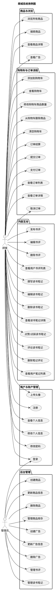

```plantuml
@startuml
' 设置方向和标题
left to right direction
title 商城系统用例图

' 定义参与者
actor "顾客" as Customer
actor "管理员" as Admin

' -------------------- 用户与账户管理 --------------------
package "用户与账户管理" {
  usecase "注册" as UC_Register
  usecase "登录" as UC_Login
  usecase "查看个人信息" as UC_ViewProfile
  usecase "修改个人信息" as UC_EditProfile
  usecase "修改密码" as UC_ChangePassword
  usecase "上传头像" as UC_UploadAvatar
}

' -------------------- 商品与浏览 --------------------
package "商品与浏览" {
  usecase "浏览所有商品" as UC_BrowseProducts
  usecase "搜索商品" as UC_SearchProducts
  usecase "查看商品详情" as UC_ViewProductDetail
  usecase "查看广告" as UC_ViewAds
}

' -------------------- 购物车与订单流程 --------------------
package "购物车与订单流程" {
  usecase "添加到购物车" as UC_AddToCart
  usecase "查看购物车" as UC_ViewCart
  usecase "修改购物车商品数量" as UC_UpdateCartQuantity
  usecase "从购物车删除商品" as UC_RemoveFromCart
  usecase "清空购物车" as UC_ClearCart
  usecase "订单结算" as UC_Checkout
  usecase "提交订单" as UC_SubmitOrder
  usecase "支付订单" as UC_PayOrder
  usecase "查看订单列表" as UC_ViewOrderList
  usecase "查看订单详情" as UC_ViewOrderDetail
  usecase "取消订单" as UC_CancelOrder
}

' -------------------- 内容互动 (书评与笔记) --------------------
package "内容互动" {
  usecase "发布书评" as UC_PostReview
  usecase "编辑书评" as UC_EditReview
  usecase "删除书评" as UC_DeleteReview
  usecase "查看用户书评列表" as UC_ViewUserReviews
  usecase "撰写读书笔记" as UC_CreateNote
  usecase "编辑读书笔记" as UC_EditNote
  usecase "删除读书笔记" as UC_DeleteNote
  usecase "查看读书笔记详情" as UC_ViewNoteDetail
  usecase "点赞/点踩读书笔记" as UC_RateNote
  usecase "评论读书笔记" as UC_CommentNote
  usecase "删除笔记评论" as UC_DeleteNoteComment
  usecase "查看用户笔记列表" as UC_ViewUserNotes
}

' -------------------- 后台管理 --------------------
package "后台管理" {
  usecase "创建商品" as UC_AdminCreateProduct
  usecase "更新商品信息" as UC_AdminUpdateProduct
  usecase "删除商品" as UC_AdminDeleteProduct
  usecase "管理商品库存" as UC_AdminManageStock
  usecase "创建广告" as UC_AdminCreateAd
  usecase "更新广告信息" as UC_AdminUpdateAd
  usecase "删除广告" as UC_AdminDeleteAd
  usecase "管理书评" as UC_AdminManageReviews
  usecase "管理读书笔记" as UC_AdminManageNotes
}

' -------------------- 定义关联关系 --------------------

' -- Customer 关联 --
Customer --> UC_Register
Customer --> UC_Login
Customer --> UC_ViewProfile
Customer --> UC_EditProfile
Customer --> UC_ChangePassword
Customer --> UC_UploadAvatar
Customer --> UC_BrowseProducts
Customer --> UC_SearchProducts
Customer --> UC_ViewProductDetail
Customer --> UC_ViewAds
Customer --> UC_AddToCart
Customer --> UC_ViewCart
Customer --> UC_UpdateCartQuantity
Customer --> UC_RemoveFromCart
Customer --> UC_ClearCart
Customer --> UC_Checkout
Customer --> UC_SubmitOrder
Customer --> UC_PayOrder
Customer --> UC_ViewOrderList
Customer --> UC_ViewOrderDetail
Customer --> UC_CancelOrder
Customer --> UC_PostReview
Customer --> UC_EditReview
Customer --> UC_DeleteReview
Customer --> UC_ViewUserReviews
Customer --> UC_CreateNote
Customer --> UC_EditNote
Customer --> UC_DeleteNote
Customer --> UC_ViewNoteDetail
Customer --> UC_RateNote
Customer --> UC_CommentNote
Customer --> UC_DeleteNoteComment
Customer --> UC_ViewUserNotes

' -- Admin 关联 --
Admin --> UC_Login
Admin --> UC_AdminCreateProduct
Admin --> UC_AdminUpdateProduct
Admin --> UC_AdminDeleteProduct
Admin --> UC_AdminManageStock
Admin --> UC_AdminCreateAd
Admin --> UC_AdminUpdateAd
Admin --> UC_AdminDeleteAd
Admin --> UC_AdminManageReviews
Admin --> UC_AdminManageNotes

@enduml
```
