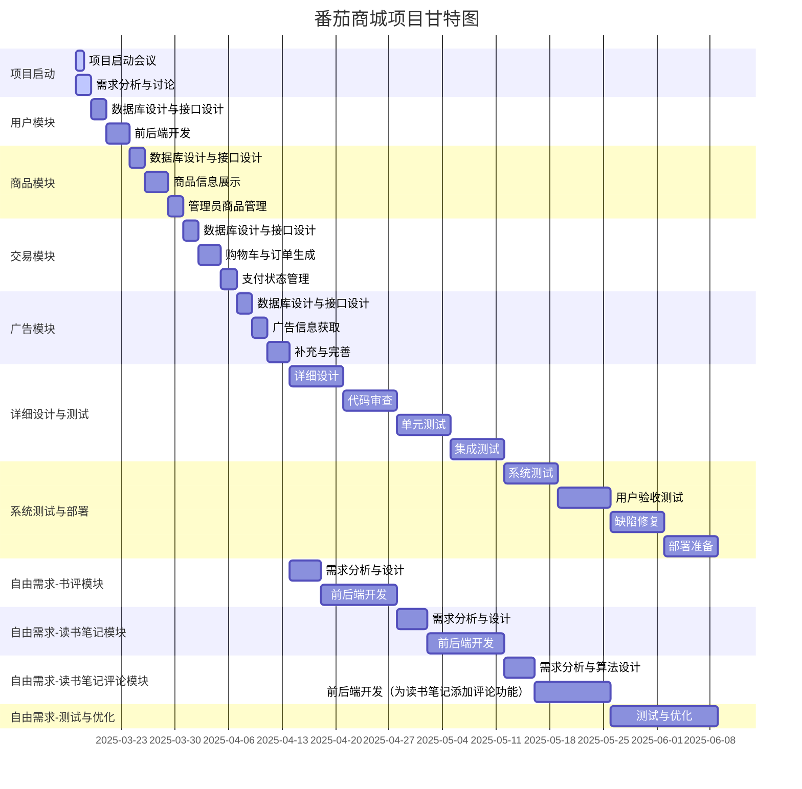

# 项目启动文档

## 项目名称

番茄商城（Tomato Bookstore）

## 项目背景

随着人们对知识的追求和文化消费的升级，实体书市场展现出复苏与增长潜力。番茄读书拟开展线上商城购买实体书业务，为读者提供便捷、丰富的购书体验，同时为出版社和作者提供新的展示与销售渠道。本项目旨在构建一个具有良好用户体验和可扩展性的线上图书销售平台。

## 项目目标

- 构建一个功能完善、用户友好的线上图书商城，满足用户浏览、搜索、购买图书的需求。
- 提供后台管理功能，方便管理员管理图书信息、库存、订单和用户。
- 系统具有良好的可扩展性，能够支持未来新增的业务需求（如书评、读书笔记、直播卖书等）。
- 培养团队成员的软件工程实践能力，熟悉软件开发流程。

## 项目范围

本项目主要包括以下功能模块：
- **用户模块**：用户注册、登录、个人信息管理（查看与修改）。
- **商品模块**：商品信息展示（全部商品、指定商品）、商品管理（增删改、库存调整）。
- **交易模块**：购物车、订单生成、支付状态管理（支付、取消）。
- **广告模块**：广告信息获取。
- **拓展模块（可选）**：
    - **书评模块**：用户发布、浏览书评。
    - **读书笔记模块**：用户撰写、分享读书笔记。
    - **读书笔记评论模块**：为读书笔记添加评论功能。

## 项目里程碑及时间表

### 必选需求的时间表

1. **Week5（3.17-3.23）：用户模块**
    - 3.17-3.18：项目启动会议，需求分析与讨论。
    - 3.19-3.20：用户模块数据库设计、接口设计。
    - 3.21-3.23：用户模块前后端开发（注册、登录、个人信息管理）。
2. **Week6（3.24-3.30）：商品管理与查询模块**
    - 3.24-3.25：商品模块数据库设计、接口设计。
    - 3.26-3.28：商品信息展示功能开发（全部商品、指定商品）。
    - 3.29-3.30：管理员商品管理功能开发（增删改、库存调整）。
3. **Week7（3.31-4.6）：交易与支付管理模块**
    - 3.31-4.1：交易模块数据库设计、接口设计。
    - 4.2-4.4：购物车、订单生成功能开发。
    - 4.5-4.6：支付状态管理功能开发（支付、取消）。
4. **Week8（4.7-4.13）：广告管理模块，补充 Week6, Week7 的内容**
    - 4.7-4.8：广告模块数据库设计、接口设计。
    - 4.9-4.10：广告信息获取功能开发。
    - 4.11-4.13：完善商品管理与交易模块，处理遗留问题。
5. **Week9-12（4.14-5.11）：**
    - 详细设计、代码审查、单元测试、集成测试。
6. **Week13-16（5.12-6.9）：**
    - 系统测试、用户验收测试（UAT）、缺陷修复、项目部署准备。

### 自由需求的时间表

考虑到项目的实际情况和时间限制，自由需求的开发将采取迭代式、增量式的方式进行。在保证必选需求完成的前提下，逐步实现自由需求。
1. **Week9-10（4.14-4.27）：书评模块**
    - 需求分析、数据库设计、接口设计。
    - 前后端开发（用户发布、浏览书评）。
2. **Week11-12（4.28-5.11）：读书笔记模块**
    - 需求分析、数据库设计、接口设计。
    - 前后端开发（用户撰写、分享读书笔记）。
3. **Week13-14（5.12-5.25）：读书笔记评论模块**
    - 需求分析、算法设计。
    - 前后端开发（为读书笔记添加评论功能）。
4. **Week15-16（5.26-6.9）：**
    - 自由需求模块的测试、优化与完善。

## 甘特图

## 资源概览和任务分配

- **人员**：单人小组
- **技术栈**：Vue3 + Vite, SpringBoot + JPA, MySQL
- **开发工具**：VS Code, IntelliJ IDEA, ApiFox
- **版本控制**：GitHub

**任务分配（初步）**：
- **[PilgrimLyieu](https://github.com/pilgrimlyieu)（组长）**：统筹规划、前后端开发、文档编写，负责项目的所有工作

## 人员配置表

|                      姓名                       |   角色   |            主要职责            |
|                       :-:                       |   :-:    |              :-:               |
| [PilgrimLyieu](https://github.com/pilgrimlyieu) |   组长   | 项目管理、前后端开发、文档编写 |

## 沟通计划

- **例会**：每周一次例会，讨论项目进展、问题和计划。
- **即时沟通**：使用 QQ, GitHub 等平台进行日常沟通。
- **代码审查**：每次提交代码前进行代码审查，确保代码质量。
- **文档共享**：通过 GitHub 仓库共享项目文档、设计文档、会议记录等。
